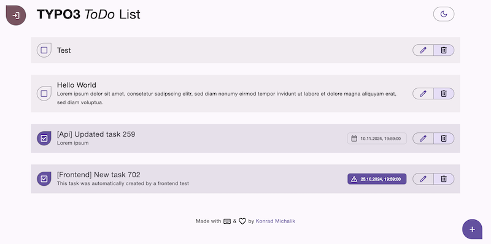

<div align="center">


# TYPO3 extension `typo3_todo_list`

[]()

</div>

> This extension provides a simple todo list application for TYPO3.



## Content

- [Task](#task)
- [Install](#install)
- [Technologies](#technologies)
- [Development](#development)
    * [Frontend](#frontend)
- [Code Quality](#code-quality)
    * [Frontend](#frontend-1)
    * [Backend](#backend)
- [Tests](#tests)
- [Outlook](#outlook)

## Task

#### 1. **Core Features**
- [x] Display tasks (if tasks are present)
- [x] Show a form to add new tasks if no tasks are available
- [x] Allow the creation of new tasks at any time
- [x] Task structure:
    - **Title** (required)
    - Description (optional)
    - Due date (optional)
- [x] Highlight tasks that are nearing or past their due date
- [x] Enable editing, completing, and deleting tasks

#### 2. **User Experience**
- [x] Ensure intuitive and easy-to-use interface
- [x] Consistent and appealing UI design
- [x] Recognizable and cross-platform interface design

#### 3. **Technical Considerations**
- [x] Use modern technical approaches for cross-platform reusability
- [x] Implement frameworks or custom designs for UI and UX
- [x] Use tests to ensure code quality

#### 4. **PWA (Optional)**
- [ ] Support offline functionality (viewing, editing, and deleting tasks)
- [ ] Option to save the application as a Progressive Web App (PWA)

#### 5. **Additional Notes**
- [x] Focus on a user-friendly and maintainable codebase

## Install

The project uses [ddev](https://ddev.readthedocs.io/en/stable/) for local development.

Start the ddev container:

```shell
ddev start
```

Launch the application:

```shell
ddev launch
```

> Default credentials for TYPO3 backend:
>
> User: `admin`, Password: `Password1!`

## Technologies

The application uses the following basis technologies:

- **Frontend**:
  - [beercss](https://www.beercss.com/)
  - [svelte](https://svelte.dev/)
- **Backend**:
  - TYPO3 v13
  - [t3api Extension](https://extensions.typo3.org/extension/t3api)

## Development

Change the application context to `Development` and restart the ddev container:

```shell
echo "web_environment:
- TYPO3_CONTEXT=Development" > .ddev/config.local.yaml

ddev restart
```

### Frontend

The frontend build process is based on [postcss](https://postcss.org/) and [esbuild](https://esbuild.github.io/).

Run the following command on development context to start the file watcher building process:

```shell
ddev npm run watch
```

Run the following command on production context to build the frontend:

```shell
ddev npm run build
```

Change the devMode in [Logger.ts](Resources/Private/JavaScript/utils/Logger.ts) to `true` to enable extending browser console logs.

## Code Quality

### Frontend

```shell
ddev npm run es:lint
ddev npm run es:format
```

### Backend

```shell
ddev composer php:lint
ddev composer php:fixer
ddev composer php:stan
ddev composer xml:lint
```

## Tests

The application uses [playwright](https://playwright.dev/) for testing.

Therefor several frontend **acceptance** and **api** tests are provided.

Initial setup:

```shell
ddev npm run test:install
```

Run the tests:

```shell
ddev npm run test
```

## Outlook

The following *todos* are open for further development:

- the PWA functionality is prepared, but not yet fully implemented
  - also should have a look at the svelte service worker: https://svelte.dev/docs/kit/service-workers
  - service worker saves the tasks in the local storage and syncs them with the server when the connection is back
  - cache the whole app for offline usage is not implemented yet
- make the svelte javascript fully typescript compliant
- usability improvements
  - add a confirmation dialog for deleting tasks
  - maybe due date only for the future
  - add a filter for the tasks
